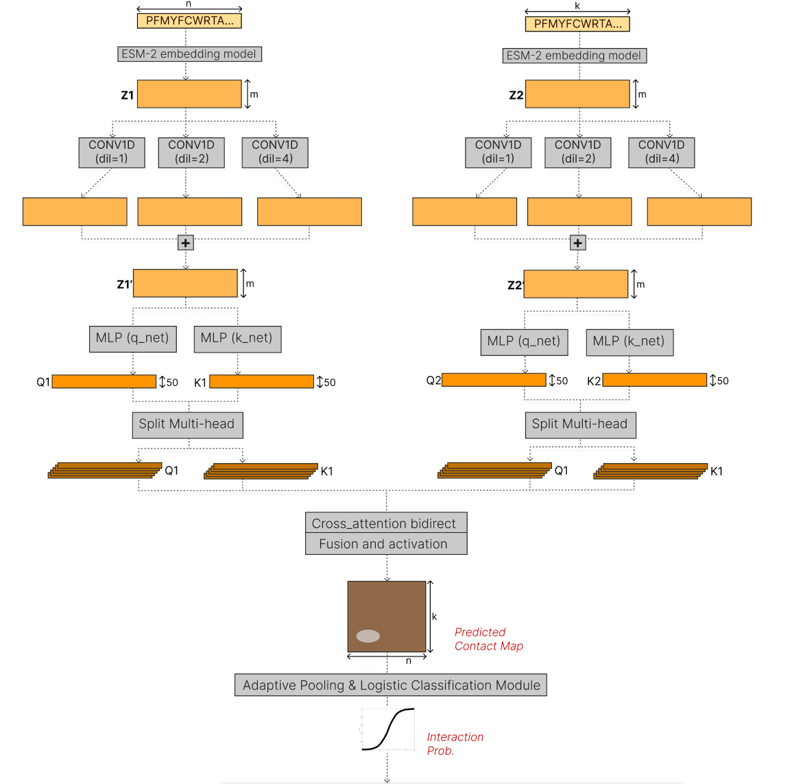

# Thesis: Protein-Protein Interaction Prediction with ESM-2 and a Custom Model

## Overview
This repository contains the thesis work on protein-protein interaction (PPI) prediction, with a comparison between:

- pre-trained D-SCRIPT baseline
- custom model based on ESM-2 embeddings + bidirectional cross-attention module + logistic classification

The main experimental flow is documented in the notebook:

- [appunti/esm2-v2 (4).ipynb](appunti/esm2-v2%20(4).ipynb)

The core idea is to improve cross-species generalization by leveraging contextual protein embeddings (ESM-2) and a predicted contact map with multi-head attention.

## Thesis objective
The objective of the project is to build and evaluate a complete pipeline that:

1. prepares balanced/unbalanced PPI datasets in a controlled way
2. generates protein embeddings from sequence with ESM-2
3. trains a custom model to infer interaction probability
4. compares performance with D-SCRIPT across multiple organisms

## Model architecture
The following figure summarizes the architecture implemented in the notebook.

### How to read the diagram
- Each protein is encoded by ESM-2 into a sequence of vectors (embedding per residue).
- The two tensors Z1 and Z2 pass through parallel dilated Conv1D blocks (dilations 1, 2, 4) to capture local patterns at different scales.
- Features pass through two MLPs (q_net and k_net) and are split into multi-heads.
- Bidirectional cross-attention is applied between the two proteins.
- The maps are fused and activated to obtain a Predicted Contact Map.
- An adaptive pooling + logistic activation module produces the final interaction probability.

The notebook includes two main variants:

- CustomAttentionPPI (static spatial affinity matrix)
- CustomAttentionPPI_Auto (learnable 7x7 affinity matrix)

## ETL Pipeline (Extract, Transform, Load)
The ETL phase is distributed across multiple scripts and prepares data for training and evaluation.

### 1) Extract
Main sources:

- STRING physical links (yeast, pombe, candida)
- UniProt TSV and FASTA
- organism-specific TSV/CSV datasets (e.g. drosophila)

Files/sources involved in the codebase:

- [string_lievito/4932.protein.physical.links.detailed.v12.0.txt](string_lievito/4932.protein.physical.links.detailed.v12.0.txt)
- [fasta_pombe/284812.protein.physical.links.detailed.v12.0.txt](fasta_pombe/284812.protein.physical.links.detailed.v12.0.txt)
- [candida_albicans/237561.protein.physical.links.detailed.v12.0.txt](candida_albicans/237561.protein.physical.links.detailed.v12.0.txt)
- [uniprot_lievito/uniprot_yeast.tsv](uniprot_lievito/uniprot_yeast.tsv)
- [fasta_lievito/UP000002311_559292.fasta](fasta_lievito/UP000002311_559292.fasta)

### 2) Transform
Main transformations:

- STRING ID cleaning (taxonomic prefix removal)
- high-confidence positive selection (experimental >= 700)
- negative set construction with controlled random sampling (typically 10:1 ratio)
- sequence length filtering
- deduplication/redundancy reduction via CD-HIT and cluster map
- gene/protein ID mapping to UniProt accessions
- enrichment with subcellular localization (7 GO macro-zones)

Main scripts:

- [string_lievito/cleaning_string.py](string_lievito/cleaning_string.py)
- [string_lievito/final_string_pos_neg.py](string_lievito/final_string_pos_neg.py)
- [create_dataset_kaggle.py](create_dataset_kaggle.py)
- [uniprot_lievito/create_protein_zones.py](uniprot_lievito/create_protein_zones.py)
- [uniprot_lievito/create_unified_dataset.py](uniprot_lievito/create_unified_dataset.py)
- [fasta_lievito/cd-hit.py](fasta_lievito/cd-hit.py)
- [fasta_pombe/create_pombe_training_dataset.py](fasta_pombe/create_pombe_training_dataset.py)
- [candida_albicans/create_candida_test_dataset.py](candida_albicans/create_candida_test_dataset.py)
- [fasta_drosophila/filter_dataset.py](fasta_drosophila/filter_dataset.py)

Typical ETL outputs:

- train/test datasets for fine-tuning: [dscript_train.csv](dscript_train.csv), [dscript_test.csv](dscript_test.csv)
- organism-specific test datasets
- filtered FASTA files
- unified file with GO zones and sequences: [uniprot_lievito/unified_protein_filter_ds.csv](uniprot_lievito/unified_protein_filter_ds.csv)

### 3) Load
Loading is performed in the notebook and in training scripts:

- sequence conversion to ESM-2 embeddings and H5 saving
- embedding loading into RAM with a custom PyTorch dataset
- DataLoader construction with dynamic padding and length masks

In the notebook, the dataset class is:

- YeastPPIDataset

The collate function creates:

- padded tensors for both proteins
- boolean masks to ignore padding
- subcellular localization tensors

## Experimental flow in the notebook
In the notebook [appunti/esm2-v2 (4).ipynb](appunti/esm2-v2%20(4).ipynb), the workflow is organized into blocks:

1. dependency installation
2. ESM-2 embedding generation in H5
3. dataset and dataloader definition
4. architecture definition for CustomAttentionPPI and CustomAttentionPPI_Auto
5. multi-configuration training (different loss weights)
6. evaluation on D-SCRIPT baseline and custom models
7. comparison across multiple organisms (S. cerevisiae, Drosophila, S. pombe, Candida albicans)

## Loss and biological information
The loss combines multiple contributions:

- BCE for interaction/non-interaction classification
- term on contact map magnitude/structure
- spatial penalty based on subcellular localization compatibility

In the Auto variant, the affinity matrix between cellular compartments is learnable.
In the Spatial variant, the matrix is static (hard-coded).

## Datasets and organisms
The repository contains data and scripts for:

- Saccharomyces cerevisiae (main pipeline)
- Drosophila
- Schizosaccharomyces pombe
- Candida albicans

Main folders:

- [fasta_lievito](fasta_lievito)
- [string_lievito](string_lievito)
- [uniprot_lievito](uniprot_lievito)
- [fasta_drosophila](fasta_drosophila)
- [fasta_pombe](fasta_pombe)
- [candida_albicans](candida_albicans)
- [grafici](grafici)
- [appunti](appunti)

## Evaluation and charts
Evaluation compares baseline and custom model with metrics:

- AUPR
- AUROC
- Precision
- Recall
- inference/testing time

Chart support script:

- [grafici/compare_custom_vs_dscript.py](grafici/compare_custom_vs_dscript.py)

## Software requirements
Dependencies used in the notebook (Kaggle/Colab-like):

- torch
- transformers
- h5py
- pandas
- numpy
- biopython
- tqdm
- scikit-learn
- dscript

## How to read the repository
Recommended path:

1. open the main notebook [appunti/esm2-v2 (4).ipynb](appunti/esm2-v2%20(4).ipynb)
2. read the ETL pipeline in the preprocessing modules in [string_lievito](string_lievito), [uniprot_lievito](uniprot_lievito), [fasta_lievito](fasta_lievito)
3. check the final datasets [dscript_train.csv](dscript_train.csv) and [dscript_test.csv](dscript_test.csv)
4. inspect the final charts in [grafici](grafici)

## Final note
This project implements an end-to-end pipeline for PPI prediction that integrates:

- biological knowledge (cellular localization)
- protein representations from a language model (ESM-2)
- custom neural module with bidirectional cross-attention

with multi-organism comparative validation against the D-SCRIPT baseline.