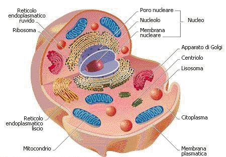
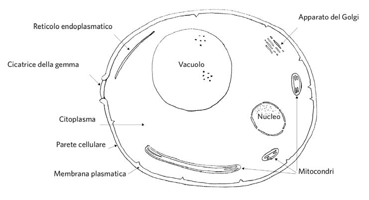

# Percorso della tesi con D-SCRIPT

## Obiettivo
In questa tesi sono partito da D-SCRIPT, un modello pre-addestrato sulle interazioni proteina-proteina umane, per costruire una pipeline sul lievito *Saccharomyces cerevisiae*. Il mio obiettivo e' stato duplice: preparare un dataset coerente con la logica del paper e capire se l'informazione sulla localizzazione subcellulare potesse aiutare il fine-tuning.

## D-SCRIPT: architettura, loss e generalizzazione
D-SCRIPT e' un modello di deep learning per la predizione di interazioni proteina-proteina che usa come input esclusivamente la sequenza amminoacidica. La sua caratteristica distintiva e' l'approccio structure-aware: pur non osservando direttamente la struttura 3D, il modello costruisce una rappresentazione intermedia che approssima i contatti fisici tra i residui delle due proteine. In questo modo la predizione finale non deriva soltanto da correlazioni statistiche tra sequenze, ma da un vincolo di compatibilita' geometrica che rende il modello piu' interpretabile.

Le sue proprieta' principali sono:
1. sequence-based: richiede solo la sequenza primaria e non necessita di strutture 3D sperimentali in input;
2. structure-aware: usa embedding proteici che codificano in modo implicito informazione conformazionale e contesto strutturale;
3. interpretabile: oltre al punteggio finale, produce una contact map che evidenzia quali regioni delle due proteine sono piu' probabilmente coinvolte nel legame.

L'architettura puo' essere scomposta in quattro moduli principali.

1. Embedding dei residui (sinonimo di amminoacidi). Le sequenze vengono elaborate con il protein language model di Bepler e Berger. Ogni amminoacido viene trasformato in un vettore ad alta dimensionalita' che, nel modello originale, ha 6165 componenti e incorpora informazione di contesto evolutivo e strutturale.
2. Proiezione in spazio compatto. Gli embedding vengono ridotti a una dimensione 100 tramite uno strato lineare con attivazione ReLU e dropout al 50%. Questa riduzione rende trattabile il confronto residuo-residuo tra le due proteine. A cosa serve in D-SCRIPT? Serve a far "parlare" i due vettori dei residui. Se entrambi i vettori hanno un valore alto nella stessa posizione, cioe' nella stessa caratteristica, il prodotto di Hadamard esalta quel valore e segnala al modello una forte compatibilita' o una proprieta' comune tra i due residui.
3. Modulo di contatto. Qui avviene la parte centrale del confronto. Il modello ha trasformato i residui in vettori numerici e ora deve decidere se il residuo $i$ della proteina A tocca il residuo $j$ della proteina B. Per ogni possibile coppia di residui calcola due feature: la loro differenza e il loro prodotto di Hadamard. Questo costruisce una sorta di identikit della relazione tra i due residui. Su questo tensore applica poi una convoluzione 2D. Si puo' immaginare una tabella in cui le righe sono i residui di A e le colonne i residui di B: la convoluzione funziona come una lente d'ingrandimento che scorre sulla tabella e non guarda solo la singola coppia, ma anche i residui vicini. Questo e' importante perche' in natura un amminoacido raramente interagisce in modo isolato; di solito sono intere regioni, come loop o eliche, ad avvicinarsi nello spazio. L'output e' una contact map $N \times M$, simile a una griglia in cui le celle piu' intense indicano che due residui sono con alta probabilita' vicini nello spazio e quindi potenzialmente in contatto fisico.
4. Pooling e scoring finale. Una volta costruita la contact map del punto 3, il modello deve ridurla a un solo numero finale che risponda alla domanda: queste due proteine interagiscono oppure no? Il pooling serve proprio a riassumere la mappa, enfatizzando le zone in cui il segnale di contatto e' piu' forte e concentrato e attenuando invece il rumore. Se nella mappa compaiono macchie luminose consistenti, significa che esistono regioni compatibili tra le due proteine. Il risultato di questa aggregazione passa poi attraverso una sigmoide, cioe' una funzione che comprime il valore nell'intervallo tra 0 e 1. Si ottiene cosi' il punteggio finale di interazione $\hat{p}$: per esempio, un valore vicino a 0.95 indica un'interazione molto probabile, mentre un valore vicino a 0.10 suggerisce che l'interazione sia improbabile.

## Esempio Giocattolo: Il flusso di D-SCRIPT

Immaginiamo di voler scoprire se due "micro-proteine" interagiscono tra loro:
* **Proteina A:** composta da 3 residui (amminoacidi). La chiameremo di lunghezza N=3.
* **Proteina B:** composta da 2 residui. La chiameremo di lunghezza M=2.

### 1. Embedding dei Residui
Il modello linguistico legge le sequenze e trasforma ogni singolo residuo in un vettore (una lista di numeri) che ne descrive le proprietà. Nella realtà D-SCRIPT usa 6165 numeri per residuo; noi ne useremo 4.

* Residuo 1 della Proteina A (A1): `[0.2, 0.8, -0.1, 0.5]`
* Residuo 1 della Proteina B (B1): `[0.1, 0.9, 0.0, 0.3]`
*(E così via per tutti gli altri residui delle due proteine...)*

### 2. Proiezione in Spazio Compatto
Gestire vettori così grandi per ogni coppia è troppo faticoso. Il modello li "schiaccia" (tramite una rete neurale lineare e la funzione ReLU) in vettori più piccoli, trattenendo solo le informazioni essenziali per il contatto. 
Fingiamo di ridurli a **2 dimensioni** (invece delle 100 del paper originale):

* Vettore proiettato di A1: `[2, 4]`
* Vettore proiettato di B1: `[1, 3]`

### 3. Modulo di Contatto (Hadamard, Differenza e Contact Map)
Ora il modello deve capire se A1 e B1 sono compatibili. Crea le "feature" calcolando la loro differenza e il loro **Prodotto di Hadamard** (moltiplicazione elemento per elemento).

**Calcolo per la coppia (A1, B1):**
* **Differenza:** `[2-1, 4-3]` = `[1, 1]`
* **Prodotto di Hadamard:** `[2*1, 4*3]` = `[2, 12]`

Questi nuovi numeri passano attraverso una **convoluzione 2D** (che guarda anche le coppie vicine, come A2-B1), generando un punteggio di probabilità di contatto per quella specifica cella. 

Il risultato per tutte le coppie crea la **Contact Map** (una griglia 3x2):

| | Residuo B1 | Residuo B2 |
| :--- | :--- | :--- |
| **Residuo A1** | 0.10 (Basso) | 0.05 (Bassissimo)|
| **Residuo A2** | **0.85 (Alto!)**| **0.90 (Alto!)** |
| **Residuo A3** | 0.20 (Basso) | 0.15 (Basso) |

*Interpretazione visiva: C'è un forte segnale di contatto (i numeri alti) tra il secondo residuo della Proteina A e tutta la Proteina B.*

### 4. Pooling e Scoring Finale
Non ci interessa solo sapere *quali* residui si toccano, ma vogliamo un voto finale sull'intera interazione: "Le proteine A e B si legano, sì o no?".

1. **Pooling:** L'algoritmo riassume la griglia qui sopra. Vede che c'è una "macchia" di forte contatto (0.85 e 0.90) e le dà molto peso, ignorando i valori bassi (il rumore). Genera un numero aggregato, ad esempio `2.5`.
2. **Sigmoide:** Trasforma questo numero grezzo in una percentuale pulita compresa tra 0 e 1. Sigmoide(2.5) = 0.92.
3. **Punteggio finale (p^):** **0.92** (ovvero il 92% di probabilità).

**Conclusione:** Il modello dichiara che la Proteina A e la Proteina B interagiscono con un'altissima probabilità, trainate dal contatto del residuo A2.

In sintesi, D-SCRIPT prende le sequenze, le trasforma in rappresentazioni numeriche complesse, confronta ogni coppia di residui usando differenze e moltiplicazioni elemento per elemento, cerca pattern locali di contatto tramite la convoluzione nella contact map e infine produce un voto finale sulla probabilita' di interazione.

Anche la funzione di perdita riflette questa impostazione. Il training usa esempi positivi ($y=1$), cioe' coppie di proteine note per interagire in database sperimentali come STRING, ed esempi negativi ($y=0$), costruiti accoppiando proteine casuali. La loss totale combina due termini:
1. Binary Cross-Entropy, che confronta il punteggio predetto $\hat{p}$ con l'etichetta reale $y$ e aumenta quando il modello assegna bassa probabilita' a una coppia positiva o alta probabilita' a una coppia negativa;
2. Magnitude Loss, che penalizza contact map troppo dense e costringe il modello a produrre pattern di contatto sparsi, quindi piu' coerenti con l'idea che l'interazione avvenga in pochi siti specifici.

La Magnitude Loss e' il punto che distingue D-SCRIPT da modelli sequence-based piu' puramente discriminativi: il modello non si limita a separare classi positive e negative, ma viene vincolato a rappresentare l'interazione come un fenomeno fisicamente plausibile. Questo vincolo e' anche la ragione per cui tende a generalizzare meglio fuori dominio, dato che le regole geometriche del contatto molecolare sono piu' stabili tra specie rispetto a pattern statistici specifici di un singolo proteoma.

Nel paper questo comportamento emerge chiaramente nel confronto cross-specie. Su organismi fuori dal dominio di training, come *Drosophila melanogaster* e *C. elegans*, D-SCRIPT ottiene AUPR sensibilmente superiori a PIPR; in Drosophila, per esempio, raggiunge circa 0.552 contro 0.278. Sull'uomo, invece, PIPR ottiene un AUPR piu' alto, circa 0.835 contro 0.516, indicando una maggiore aderenza al dominio visto in addestramento ma una minore capacita' di generalizzazione fuori distribuzione.

L'output del modello e' quindi duplice:
1. un punteggio scalare di interazione $\hat{p}$; per esempio, un valore come $\hat{p}=0.91$ indica alta probabilita' di interazione;
2. una contact map interpretabile, utile per localizzare le regioni che contribuiscono maggiormente al legame.

## Primo ostacolo: il collo di bottiglia computazionale
Il primo problema reale e' stato computazionale. D-SCRIPT costruisce una mappa di contatto di dimensione $N \times M$, dove $N$ e $M$ sono le lunghezze delle due proteine. Poiche' le lunghezze variano molto, un batching classico richiederebbe padding e maschere 2D. L'architettura base, pero', non gestisce questo caso in modo nativo: padding arbitrario influenzerebbe la ContactCNN, il pooling e il calcolo finale del punteggio. Per questo ho dovuto filtrare con attenzione le lunghezze e costruire la pipeline dati in modo conservativo.

## Dati di partenza
Ho lavorato con quattro sorgenti complementari, ognuna necessaria per ricostruire una vista coerente di identificativi, sequenze, annotazioni subcellulari e interazioni.
1. UniProt TSV, per ottenere `Entry`, `Entry Name`, `Gene Names`, `Length` e annotazioni `Gene Ontology (cellular component)`. Un esempio e' la riga `D6VTK4 | STE2_YEAST | STE2 YFL026W | 431 | plasma membrane [GO:0005886]`, che fornisce in un solo record identificativo UniProt, nome del gene, lunghezza della proteina e compartimento cellulare annotato.
2. UniProt FASTA, per ottenere le sequenze aminoacidiche del lievito. Un esempio e' l'header `>sp|P00927|THDH_YEAST ... GN=ILV1`, seguito dalla sequenza che inizia con `MSATLLKQPLCTVVRQ...`; questa e' l'informazione grezza che viene poi usata come input sequence-based per D-SCRIPT.
3. STRING physical links, per ottenere coppie candidate di interazioni fisiche con un punteggio sperimentale associato. Un esempio e' `4932.Q0045 4932.YML030W 734`, dove `734` e' il valore della colonna `experimental`; dopo la rimozione del prefisso tassonomico `4932.`, questa riga diventa una coppia proteica candidata ad alta confidenza.
4. Gene Ontology in formato OBO, per risalire dai termini GO specifici alle macro-aree cellulari attraverso le relazioni ontologiche. Un esempio e' il termine `retrotransposon nucleocapsid`, che nel file `go-basic.obo` compare come `part_of GO:0005634 ! nucleus`: questo permette di ricondurre annotazioni molto specifiche alla macro-zona `nucleus`.

L'integrazione di queste quattro sorgenti e' stata necessaria per collegare gli ID delle proteine, recuperare le sequenze, filtrare le interazioni fisiche affidabili e normalizzare annotazioni GO molto eterogenee in un numero limitato di compartimenti biologicamente interpretabili.

Un punto importante e' che il modello D-SCRIPT pre-addestrato non ha mai visto il database STRING del lievito: il suo training originale e' umano. Quindi tutta la preparazione dati e' servita davvero a costruire un dominio nuovo.

## La pipeline ETL che ho costruito

### 1. Ho trasformato le annotazioni GO in macro-zone biologiche
Il primo problema semantico era che le annotazioni UniProt non usano etichette semplici come `nucleus` o `cytoplasm`, ma termini molto specifici, per esempio `nucleoplasmic THO complex`. Un confronto testuale diretto sarebbe stato sbagliato: due proteine nello stesso compartimento avrebbero potuto risultare artificialmente diverse.

Un esempio concreto e' la proteina THP2 (`O13539`), che in UniProt compare con annotazioni come `nucleoplasmic THO complex [GO:0000446]`, `THO complex [GO:0000347]`, `THO complex part of transcription export complex [GO:0000445]` e `transcription export complex [GO:0000346]`. Biologicamente THP2 e' una subunita' del complesso THO/TREX, un macchinario nucleare coinvolto nell'accoppiamento tra trascrizione ed export dell'mRNA verso il citoplasma. Se la confrontassi con una proteina annotata semplicemente come `nucleus [GO:0005634]`, un match testuale diretto fallirebbe: la parola `nucleus` potrebbe non comparire esplicitamente, anche se il significato biologico resta chiaramente nucleare.

Il punto chiave e' che GO non e' una lista piatta, ma un grafo gerarchico. Termini molto specifici come `GO:0000446` o `GO:0000347` non vanno trattati come stringhe isolate: bisogna risalire gli antenati ontologici e ricondurli a una macro-area interpretabile. Per questo ho usato `goatools`, che mi permette di partire dai GO ID specifici e propagare ogni annotazione verso compartimenti piu' generali.

Un modo intuitivo di vedere il problema e' pensare alla Gene Ontology come a un sistema di indirizzi biologici, simile a Google Maps. Se una proteina e' annotata con un termine molto specifico, per esempio `GO:0005743` che indica la membrana mitocondriale interna, questo non basta da solo per dire immediatamente in quale macro-area ricada. Bisogna avere una mappa gerarchica che dica che quel termine appartiene a una categoria piu' generale, fino a risalire a `mitochondrion` (`GO:0005739`). In altre parole, per la tesi non mi interessa il dettaglio finissimo dell'"indirizzo", ma il fatto che quell'indirizzo stia dentro una delle macro-zone biologiche che voglio usare.

Qui entra in gioco `goatools`. Il file `go-basic.obo` e' la mappa completa della Gene Ontology: contiene i termini GO e le loro relazioni di parentela, cioe' chi e' padre, figlio o parte di chi. Quando nel codice carico `GODag("go-basic.obo")`, trasformo quel file testuale in un grafo navigabile in memoria. Questo mi permette di prendere un termine GO qualsiasi e chiedere quali siano tutti i suoi antenati ontologici.

Il funzionamento di [uniprot_lievito/create_protein_zones.py](../uniprot_lievito/create_protein_zones.py) puo' essere letto in quattro passaggi molto semplici. Prima definisco i 7 "cestoni" finali nel dizionario `MACRO_ZONES`, cioe' le macro-zone in cui voglio smistare le proteine. Poi uso la funzione `get_all_ancestors(go_id)` come motore di risalita: partendo da un termine GO specifico, la funzione visita i genitori, poi i genitori dei genitori, e cosi' via fino ai livelli piu' generali del grafo. Successivamente leggo `uniprot_yeast.tsv` e, con una espressione regolare, estraggo dal testo della colonna GO solo i codici del tipo `GO:1234567`, ignorando il resto della descrizione. Infine, per ogni proteina, confronto l'insieme dei termini antenati con i 7 GO ID delle macro-zone: se tra gli antenati compare, per esempio, l'ID del nucleo o del mitocondrio, assegno `1` alla colonna corrispondente. Se una proteina ricade in piu' macro-aree, lo script le mantiene tutte, ed e' proprio per questo che alcune risultano multi-zona.

Per risolvere questo problema ho scritto [uniprot_lievito/create_protein_zones.py](../uniprot_lievito/create_protein_zones.py). In questo script:
1. carico `go-basic.obo` con `goatools`;
2. estraggo i GO ID dalla colonna `Gene Ontology (cellular component)`;
3. risalgo gli antenati di ogni termine;
4. mappo ogni proteina in 7 macro-zone:
- `nucleus` (`GO:0005634`)
- `cytoplasm` (`GO:0005737`)
- `mitochondrion` (`GO:0005739`)
- `plasma_membrane` (`GO:0005886`)
- `endoplasmic_reticulum` (`GO:0005783`)
- `golgi_apparatus` (`GO:0005794`)
- `vacuole` (`GO:0005773`)

L'output e' [uniprot_lievito/protein_zones.csv](../uniprot_lievito/protein_zones.csv). Questo passaggio e' stato fondamentale anche per i casi multi-zona, perche' alcune proteine o complessi non stanno in una sola area netta della cellula.

### 2. Ho unificato annotazioni, sequenze e filtro di lunghezza
Dopo la normalizzazione GO ho scritto [uniprot_lievito/create_unified_dataset.py](../uniprot_lievito/create_unified_dataset.py). Qui ho costruito il mio catalogo proteico di riferimento:
1. carico `uniprot_yeast.tsv`;
2. unisco le macro-zone di `protein_zones.csv`;
3. aggancio la sequenza aminoacidica dal FASTA;
4. elimino la colonna GO testuale originale;
5. tengo solo le proteine con lunghezza compresa tra 50 e 800 amminoacidi.

L'output e' [uniprot_lievito/unified_protein_filter_ds.csv](../uniprot_lievito/unified_protein_filter_ds.csv). Questo file e' il catalogo proteico completo usato in tutto il resto della pipeline: per ogni proteina contiene identificativi UniProt, gene names, lunghezza, indicatori binari delle macro-zone cellulari, lista sintetica delle zone e sequenza aminoacidica. Ho scelto l'intervallo 50-800 perche' le proteine molto corte sono poco informative dal punto di vista strutturale, mentre quelle troppo lunghe rendono D-SCRIPT molto costoso in memoria.

### 3. Ho pulito STRING tenendo solo interazioni fisiche affidabili
In parallelo ho ripulito STRING con [string_lievito/cleaning_string.py](../string_lievito/cleaning_string.py). In questo passaggio:
1. rimuovo il prefisso tassonomico `4932.`;
2. ispeziono la distribuzione della colonna `experimental`;
3. tengo solo le interazioni con `experimental >= 700`;
4. rimuovo colonne come `database`, `textmining` e `combined_score`.

Qui ho fatto una scelta volutamente conservativa. In teoria si potrebbe usare qualsiasi evidenza sperimentale positiva, ma nel mio ETL ho preferito una soglia alta per costruire un set di interazioni fisiche piu' pulito e meno rumoroso. L'output di questo step e' [string_lievito/string_high_confidence.csv](../string_lievito/string_high_confidence.csv).

### 4. Ho risolto il mismatch tra ID STRING e ID UniProt
Il problema successivo e' stato pratico ma decisivo: STRING e UniProt non usano lo stesso identificatore. STRING lavora spesso con gene names o locus tag, mentre il mio catalogo proteico era indicizzato sugli accession UniProt. Senza una traduzione esplicita, le coppie non si allineavano alle sequenze.

Per risolvere questa incompatibilita' ho scritto [string_lievito/final_string_pos_neg.py](../string_lievito/final_string_pos_neg.py). In questo script:
1. costruisco una mappa `gene_name -> UniProt Entry` partendo dalla colonna `Gene Names` di UniProt;
2. traduco `protein1` e `protein2` del file STRING in accession UniProt;
3. scarto le coppie che non riesco a tradurre;
4. tengo solo le coppie in cui entrambe le proteine sono presenti in `unified_protein_filter_ds.csv`;
5. rendo ogni coppia canonica come `(min, max)`, cosi' elimino i duplicati speculari;
6. genero esempi negativi casuali con rapporto 10:1 rispetto ai positivi, evitando collisioni con il set positivo.

La scelta del rapporto 10:1 riflette la forte asimmetria biologica del problema: se si estraggono due proteine a caso nella cellula, nella grande maggioranza dei casi non interagiscono. Un dataset artificiale bilanciato 1:1 renderebbe il modello troppo ottimista e aumenterebbe il rischio di falsi positivi in inferenza.

L'output finale e' [string_lievito/string_final_dataset.csv](../string_lievito/string_final_dataset.csv). Questo file rappresenta il dataset PPI vero e proprio, con `protein1`, `protein2` e `label`.

### 5. Ho usato CD-HIT per rimuovere la ridondanza di sequenza
Una volta ottenuto il dataset PPI, ho affrontato il problema della ridondanza. Se due coppie sono quasi identiche dal punto di vista della sequenza, il modello puo' imparare per memoria invece di generalizzare. Per questo ho usato CD-HIT con soglia di identita' del 40%, come nel paper.

La motivazione metodologica e' evitare data leakage tra training e test. Se nel training set fosse presente una coppia A-B e nel test set una coppia C-D molto simile, per esempio con proteine quasi equivalenti al 90% dal punto di vista della sequenza, il modello potrebbe predire correttamente C-D non perche' ha imparato le regole fisiche dell'interazione, ma perche' sta riutilizzando informazione gia' vista. Eliminare la ridondanza serve quindi a impedire la memorizzazione di casi quasi duplicati e a valutare in modo piu' realistico la capacita' del modello di generalizzare a proteine non viste.

La scelta del 40% non e' arbitraria. In bioinformatica strutturale una soglia attorno al 40% viene spesso descritta come una zona critica dell'identita' di sequenza, talvolta richiamata anche come *Twilight Zone*, perche' sopra questo livello due proteine hanno ancora un'elevata probabilita' di condividere lo stesso fold tridimensionale. In un contesto di machine learning questo significa che un modello potrebbe "indovinare" le interazioni per semplice analogia di sequenza, invece di apprendere davvero i principi chimico-fisici del legame. Portando il filtro a 40%, come fanno anche gli autori di D-SCRIPT, si riduce proprio questo rischio: sotto tale soglia le sequenze possono apparire gia' molto diverse, anche quando mantengono una certa somiglianza strutturale, e quindi il compito diventa molto piu' vicino a una vera generalizzazione fuori famiglia.

Per preparare l'input di CD-HIT ho scritto [fasta_lievito/cd-hit.py](../fasta_lievito/cd-hit.py). In questo script pulisco gli header UniProt e genero un FASTA dedicato alla clusterizzazione. La parte importante, pero', non e' il FASTA ridotto in se', ma il file `proteins_cdhit.clstr`, cioe' la mappa dei cluster.

Il comando usato e' stato:

```bash
cd-hit -i cdhit_ready_yeast.fasta -o proteins_cdhit -c 0.4 -n 2 -M 0 -d 0
```

Ogni parametro del comando ha una motivazione precisa:
1. `-c 0.4` impone la soglia di clustering al 40% di sequence identity, cioe' raggruppa insieme le sequenze che hanno identita' uguale o superiore a questo valore. E' la stessa soglia usata dagli autori di D-SCRIPT ed e' abbastanza severa da ridurre la ridondanza senza eliminare ogni possibile parentela remota.
2. `-n 2` imposta la word length, cioe' la lunghezza dei piccoli frammenti usati da CD-HIT per cercare somiglianze in modo veloce. A soglie basse come il 40% il manuale richiede parole molto corte, altrimenti l'algoritmo rischia di non intercettare le similarita' residue tra sequenze lontane.
3. `-M 0` dice a CD-HIT di non imporre un limite artificiale di memoria e di usare tutta la RAM disponibile. In pratica questo rende l'esecuzione piu' veloce, soprattutto quando il numero di sequenze cresce.
4. `-d 0` impedisce il troncamento delle descrizioni nel file di output. Nel mio caso era utile per mantenere intatti gli identificativi gia' ripuliti nello script Python, evitando che gli ID proteici venissero abbreviati proprio nel passaggio in cui servivano chiari e stabili.

### 6. Ho costruito i file finali per Kaggle leggendo il file `.clstr`
L'ultimo passaggio della pipeline e' in [create_dataset_kaggle.py](../create_dataset_kaggle.py). In questo script:
1. leggo `proteins_cdhit.clstr` e costruisco la mappa `proteina -> cluster`;
2. carico `string_final_dataset.csv`;
3. trasformo ogni interazione in una coppia di cluster ordinata;
4. tengo solo la prima occorrenza di ogni coppia cluster-cluster;
5. assegno un cluster fittizio `Missing_*` alle proteine che non compaiono nel `.clstr`, cosi' il filtro non si rompe;
6. eseguo uno split stratificato 80/20;
7. salvo [dscript_train.csv](../dscript_train.csv) e [dscript_test.csv](../dscript_test.csv).

Il risultato finale della fase ETL e' quindi la generazione dei due file pronti per l'addestramento e la valutazione del modello. Ogni riga di [dscript_train.csv](../dscript_train.csv) e [dscript_test.csv](../dscript_test.csv) contiene una coppia di proteine (`protein1`, `protein2`) e un'etichetta binaria `label`, dove `1` indica un'interazione positiva e `0` un negativo sintetico. In altre parole, dopo il filtro di lunghezza, l'unificazione delle annotazioni, la traduzione degli ID, la generazione dei negativi e la rimozione della ridondanza con CD-HIT, la pipeline produce direttamente il dataset supervisionato finale.

In pratica, il file `.clstr` e' stato utile solo come mappa delle parentele tra proteine. Il FASTA compresso prodotto da CD-HIT non entra direttamente nella rete: cio' che mi serviva davvero era l'informazione di cluster per evitare leakage tra famiglie troppo simili.

## Come ho impostato il fine-tuning
Dopo la preparazione dati ho impostato uno scheletro di fine-tuning in [dscript_finetuning_kaggle.py](../dscript_finetuning_kaggle.py). L'idea e' stata:
1. caricare il modello D-SCRIPT pre-addestrato sull'uomo;
2. congelare i moduli di embedding e projection;
3. aggiornare solo i moduli piu' vicini alla contact map e alla decisione finale;
4. usare la loss originale di classificazione come base e aggiungere una penalita' semantica legata alla localizzazione cellulare.

Nel codice questo si vede in tre punti:
1. carico `zone_map` da `unified_protein_filter_ds.csv`;
2. imposto `requires_grad = False` per i parametri di embedding e projection;
3. preparo una loss con `BCEWithLogitsLoss` e una penalita' additiva pesata da `PENALTY_LAMBDA`.

## Il vero problema della semantic loss
L'idea della semantic loss era semplice: se due proteine appartengono a compartimenti incompatibili, il modello dovrebbe essere penalizzato quando predice un'interazione forte. In pratica, pero', la biologia e' meno rigida di quanto sembri.

Il primo errore che avrei potuto fare era usare le etichette GO come semplici stringhe. L'ho evitato con la mappatura a macro-zone. Il secondo errore, ancora piu' grave, sarebbe stato assumere che zone diverse significhi sempre nessuna interazione. Non e' vero:
1. il citoplasma e' in contatto con la superficie esterna di molti organelli;
2. ER e mitocondrio hanno siti di contatto diretti;
3. ER e Golgi comunicano continuamente;
4. Golgi e membrana plasmatica sono collegati dal traffico vescicolare;
5. molte proteine sono multi-zona.

Per questo la semantic loss ha senso solo come prior morbida, non come regola binaria. Le incompatibilita' davvero forti sono poche, per esempio:
- nucleo <-> mitocondrio
- nucleo <-> vacuolo
- mitocondrio <-> vacuolo
- nucleo <-> membrana plasmatica

Tutte le altre combinazioni vanno trattate con molta piu' cautela. In altre parole, la localizzazione subcellulare puo' aiutare il modello, ma solo se la penalita' resta biologicamente informata e non diventa un vincolo troppo rigido.

## Stato finale del lavoro
Alla fine del percorso ho ottenuto una pipeline ordinata e riproducibile:
1. da UniProt e GO ho ottenuto [uniprot_lievito/protein_zones.csv](../uniprot_lievito/protein_zones.csv) e [uniprot_lievito/unified_protein_filter_ds.csv](../uniprot_lievito/unified_protein_filter_ds.csv);
2. da STRING ho ottenuto [string_lievito/string_high_confidence.csv](../string_lievito/string_high_confidence.csv) e [string_lievito/string_final_dataset.csv](../string_lievito/string_final_dataset.csv);
3. con CD-HIT e il filtro sui cluster ho ottenuto [dscript_train.csv](../dscript_train.csv) e [dscript_test.csv](../dscript_test.csv);
4. con [dscript_finetuning_kaggle.py](../dscript_finetuning_kaggle.py) ho impostato la base per il fine-tuning del modello umano sul lievito.

La parte piu' importante che ho imparato e' che, in questo progetto, il vero lavoro non e' stato solo lanciare D-SCRIPT, ma costruire un dataset coerente con la biologia, con gli identificativi corretti, con la ridondanza sotto controllo e con una semantic loss che non semplificasse troppo un problema biologico complesso.

## Ottimizzazione e gestione degli embedding
Un passaggio separato, ma fondamentale, ha riguardato la generazione e la gestione degli embedding proteici del lievito ottenuti dal language model pre-addestrato di D-SCRIPT. L'obiettivo non era soltanto estrarre una rappresentazione vettoriale per ogni sequenza, ma farlo in un formato riutilizzabile per il successivo fine-tuning del modulo di predizione spaziale, cioe' la parte della rete che costruisce la contact map.

### 1. Il primo collo di bottiglia: costo computazionale e limite di storage
L'approccio iniziale consisteva nell'estrarre gli embedding nativi per tutte le circa 5000 proteine del dataset. In questa configurazione, ogni proteina veniva rappresentata da un tensore di dimensione $L \times 6165$, dove $L$ e' la lunghezza della sequenza e 6165 e' la dimensionalita' dell'embedding prodotto dal language model.

Su CPU, il tempo stimato per completare l'estrazione superava le 3 ore. L'uso della GPU su Kaggle, in particolare con acceleratori come T4x2 o P100, riduceva il tempo a circa 15 minuti, ma faceva emergere un problema piu' serio: il file `.h5` risultante occupava circa 30-40 GB. Questo superava il limite fisico di 20 GB della directory temporanea `/kaggle/working/`, per cui il processo veniva interrotto sistematicamente con errori di tipo out of memory sul disco.

### 2. Tentativi di compressione e uso del cloud storage
Per aggirare il limite della macchina virtuale sono state provate diverse strategie di ingegneria dei dati.

La prima e' stata la compressione del file HDF5 durante il salvataggio. In pratica e' stato applicato GZIP nativo tramite `h5py`, intervenendo direttamente nella fase di scrittura con una soluzione di monkey patching. Questo ha ridotto il peso dei file di circa il 50%, ma il margine di sicurezza restava troppo ridotto per considerare il processo stabile.

La seconda strategia e' stata il montaggio diretto di Google Drive tramite `rclone`, con l'idea di bypassare il disco locale di Kaggle. Anche questa strada si e' rivelata insufficiente: la natura di scrittura casuale dei database `.h5` costringeva `rclone`, con opzioni come `--vfs-cache-mode writes`, a creare una cache locale invisibile prima dell'upload. Di fatto, i 20 GB del filesystem temporaneo si saturavano comunque prima ancora che i dati arrivassero realmente sul cloud.

La soluzione funzionante e' stata una strategia di chunking. Il file FASTA originale e' stato suddiviso in blocchi da 1500 sequenze e uno script iterativo generava, per ogni blocco, un file `.h5` locale di circa 10 GB, quindi compatibile con i vincoli di Kaggle. Ogni file veniva poi copiato su Drive con una copia diretta, senza mantenere cache locali persistenti, e immediatamente eliminato dal disco temporaneo per liberare spazio al blocco successivo. In questo modo sono stati prodotti 5 file distinti, denominati `yeast_embeddings_part_1.h5` fino a `yeast_embeddings_part_5.h5`.

### 3. Unificazione virtuale dei file HDF5 e data loading
Una volta prodotti i 5 file, il problema non era piu' soltanto salvarli, ma leggerli in modo efficiente durante l'addestramento. Accedere direttamente ai file su Drive avrebbe introdotto un collo di bottiglia di I/O dovuto alla latenza di rete. Per questo i file sono stati reimportati in Kaggle come dataset statico, sfruttando il limite molto piu' ampio, circa 100 GB, disponibile per i dati di input.

Per usare i file senza doverli fondere fisicamente in un unico archivio e senza saturare la RAM, e' stata progettata una classe PyTorch personalizzata chiamata `MultiH5DscriptDataset`. Questa classe indicizza i 5 file separati, individua al volo il file corretto per ogni proteina e recupera i tensori in tempo reale, realizzando un'unificazione virtuale degli embedding a livello di data loader.

### 4. Architettura definitiva: proiezione anticipata e bypass del layer di embedding
Anche dopo aver risolto il problema di storage, rimaneva un vincolo forte di efficienza. Processare tensori da 6165 feature a ogni epoca rallentava drasticamente il fine-tuning e consumava troppa VRAM. La soluzione finale e' stata spostare fuori dal training una parte del lavoro del modello: gli embedding grezzi venivano fatti passare una sola volta attraverso il primo modulo di proiezione lineare del modello D-SCRIPT pre-addestrato, cioe' `FullyConnectedEmbed`, e salvati gia' nella forma ridotta $L \times 100$.

Questo cambiamento ha richiesto un adattamento dell'architettura. Per iniettare direttamente nella rete i vettori gia' compressi e' stata introdotta una classe wrapper chiamata `DScriptFineTuner`, che esclude il modulo di embedding di base del modello MIT e agisce come ponte verso la parte convoluzionale incaricata della costruzione delle mappe di contatto, cioe' `ContactCNN`.

Un dettaglio tecnico importante ha riguardato la geometria dei tensori. Gli embedding estratti venivano trasposti con un'operazione del tipo `emb.transpose(0, 1)` per allineare le 100 feature con l'asse dei canali richiesto dalle convoluzioni 1D di PyTorch. La forma finale diventava quindi `[Batch, Canali, Lunghezza]`, che e' quella compatibile con i moduli convoluzionali usati nella rete.

Il risultato di questa evoluzione e' stato un abbattimento netto dei tempi di caricamento, l'eliminazione dei crash dovuti all'esaurimento di memoria e un fine-tuning molto piu' fluido e veloce, con batch size adattato e aggiornamento limitato agli strati decisionali piu' vicini alle mappe di contatto spaziali.

### 5. Struttura interna dei file `.h5`
Dal punto di vista logico, ciascun file HDF5 e' organizzato come un dizionario. La chiave e' l'identificativo della proteina, per esempio `P00927`, mentre il valore e' un dataset HDF5 di tipo `float32` che contiene la matrice dell'embedding residuo per residuo.

Una rappresentazione schematica di un file come `yeast_embeddings_part_1.h5` e' la seguente:

```text
yeast_embeddings_part_1.h5
|
|-- P00927  (dataset float32)
|-- P04806  (dataset float32)
|-- D6VTK4  (dataset float32)
|-- O13297  (dataset float32)
`-- ...     (altre ~1500 proteine)
```

Se si apre uno di questi dataset a livello concettuale, la struttura e' una matrice in cui le righe corrispondono ai residui della sequenza e le colonne alle feature dell'embedding. Nella forma grezza originaria, prima della proiezione a 100 dimensioni, una proteina come `P00927` puo' essere rappresentata come:

```text
Proteina: P00927

			   Feature 1   Feature 2   Feature 3   ...   Feature 6165
Aminoacido 1 M    0.124      -0.842       0.004    ...      0.771
Aminoacido 2 S   -0.451       0.332       0.991    ...     -0.112
...
```

Nella versione definitiva della pipeline, la struttura logica del file resta la stessa, ma il numero di feature salvate per residuo non e' piu' 6165: dopo il passaggio anticipato in `FullyConnectedEmbed`, ogni dataset memorizza vettori gia' compressi a 100 dimensioni. Questo ha reso il formato HDF5 compatibile con il fine-tuning pratico del modello all'interno dei vincoli hardware di Kaggle.

## Integrazione di un termine di affinita' nella loss
Per rendere la penalizzazione semantica piu' realistica dal punto di vista biologico, non era sufficiente trattare tutte le coppie di compartimenti diversi come automaticamente incompatibili. Nella cellula esistono infatti zone che comunicano in modo naturale: per esempio, proteine del `cytoplasm` possono interagire con i domini intracellulari di proteine localizzate nella `plasma_membrane`, mentre proteine del `endoplasmic_reticulum` possono transitare o scambiare componenti con il `golgi_apparatus` tramite traffico vescicolare. Un approccio troppo rigido finirebbe quindi per penalizzare anche interazioni biologicamente plausibili.

La soluzione e' stata introdurre una matrice di affinita' biologica di dimensione $7 \times 7$, costruita sulle sette macro-zone usate nella pipeline:
1. `nucleus`
2. `cytoplasm`
3. `mitochondrion`
4. `plasma_membrane`
5. `endoplasmic_reticulum`
6. `golgi_apparatus`
7. `vacuole`

In questa matrice:
1. il valore `1` indica che due zone comunicano oppure sono compatibili dal punto di vista biologico, quindi la penalita' deve essere nulla;
2. il valore `0` indica che le due zone sono trattate come isolate, quindi l'interazione predetta deve essere penalizzata.

Questa matrice non e' stata costruita in modo arbitrario, ma segue la logica della compartimentazione cellulare e del traffico intracellulare descritti nei classici testi di biologia cellulare e negli studi sulla via secretoria del lievito. In particolare, la distinzione tra compartimenti relativamente isolati e compartimenti che comunicano attraverso citosol, membrane e vescicole e' coerente con la trattazione di Alberts et al. sulla compartimentazione intracellulare e sul protein sorting, mentre la continuita' funzionale della via `ER -> Golgi -> membrana/vacuolo` si appoggia ai lavori fondativi di Palade e agli studi genetici di Novick, Field e Schekman nel lievito (Alberts et al., 2014; Palade, 1975; Novick et al., 1980).

Dal punto di vista interpretativo, tre scelte della matrice sono particolarmente importanti.

1. Il citoplasma e' trattato come compartimento permissivo verso tutti gli altri. Questo non significa che qualsiasi proteina citosolica interagisca automaticamente con qualsiasi altra proteina della cellula, ma che il citosol rappresenta il mezzo fisico comune in cui sono immersi gli organelli. Molte proteine di membrana espongono domini verso il lato citoplasmatico e possono quindi risultare accessibili a partner citosolici. Per questa ragione, assegnare `1` tra `cytoplasm` e gli altri compartimenti e' un prior ragionevole: evita di penalizzare interazioni che, almeno geometricamente e topologicamente, restano possibili (Alberts et al., 2014).

2. La via secretoria giustifica gli `1` tra `endoplasmic_reticulum`, `golgi_apparatus`, `plasma_membrane` e `vacuole`. Nel sistema endomembranale le proteine non sono statiche: vengono sintetizzate nel reticolo endoplasmatico, trasferite al Golgi tramite vescicole, poi smistate verso membrana plasmatica, secrezione o vacuolo. Di conseguenza, le proteine di questi compartimenti entrano in contatto funzionale e fisico durante trasporto, maturazione e fusione di membrana. In particolare, la coppia `ER-Golgi` riflette il trasporto anterogrado iniziale, `Golgi-plasma_membrane` riflette l'esocitosi, mentre `Golgi-vacuole` e' particolarmente rilevante nel lievito, dove il vacuolo svolge funzioni analoghe a quelle del lisosoma animale ed e' raggiunto proprio attraverso sorting post-Golgi (Palade, 1975; Novick et al., 1980; Alberts et al., 2014).

3. `nucleus` e `mitochondrion` sono trattati come compartimenti relativamente isolati e quindi compatibili soprattutto con se stessi e con il `cytoplasm`. La motivazione e' che entrambe le strutture sono delimitate da membrane che impongono meccanismi di trasporto molto selettivi. Il nucleo comunica con il citoplasma attraverso i pori nucleari, ma non partecipa alla via vescicolare che collega ER, Golgi e membrana. Il mitocondrio, a sua volta, e' circondato da una doppia membrana e importa le sue proteine attraverso complessi specializzati come TOM e TIM; una proteina confinata all'interno del mitocondrio non incontra normalmente proteine residenti del Golgi o del nucleo. Per questo motivo, predizioni di interazione forti tra proteine interne a compartimenti cosi' separati sono buoni candidati a falsi positivi e la penalizzazione della rete ha una giustificazione biologica chiara (Alberts et al., 2014).

In questo modo la semantic loss non richiede piu' una corrispondenza esatta tra i compartimenti, ma usa una nozione piu' morbida di compatibilita' biologica. Due proteine in compartimenti diversi non vengono penalizzate automaticamente: la penalita' compare solo quando la coppia cade in una zona della matrice con affinita' nulla.

Operativamente, questo criterio e' stato aggiunto come terzo termine della loss, pesato da un nuovo iperparametro $\gamma$ tipicamente piccolo, per esempio 0.1 oppure 0.2. La loss complessiva diventa:

$$
Loss = \lambda \cdot L_{BCE} + (1 - \lambda) \cdot L_{MAG} + \gamma \cdot \mathrm{Mean}(\hat{p} \times \mathrm{PenaltyMask})
$$

dove:
1. $L_{BCE}$ e' il termine di classificazione binaria;
2. $L_{MAG}$ e' il termine che forza la sparsita' delle contact map;
3. $\hat{p}$ e' la probabilita' predetta di interazione;
4. `PenaltyMask` e' una maschera binaria che vale 1 solo quando la coppia deve essere davvero penalizzata.

La maschera non viene applicata indiscriminatamente. Per proteggere il fine-tuning ed evitare penalizzazioni artificiali, il termine semantico entra in gioco solo se sono soddisfatte contemporaneamente tre condizioni:
1. entrambe le proteine hanno annotazioni di zona note, quindi non ci sono casi vuoti o completamente non annotati;
2. la label reale e' `0`, cioe' la coppia appartiene ai veri negativi;
3. la matrice di affinita' assegna valore `0` alla coppia di compartimenti considerata.

Se invece le due proteine hanno annotazioni mancanti, oppure appartengono a zone che comunicano biologicamente, oppure la coppia e' un positivo reale, la penalita' viene annullata. In questo modo il termine aggiuntivo non sostituisce la loss originale di D-SCRIPT, ma la corregge con un prior biologico controllato, abbastanza forte da scoraggiare falsi positivi in compartimenti realmente incompatibili e abbastanza morbido da non danneggiare interazioni plausibili tra compartimenti comunicanti.

Se si volesse esplicitare questa scelta anche a livello bibliografico nel testo della tesi, i riferimenti piu' adatti sono:
1. Alberts, B. et al. (2014). *Molecular Biology of the Cell* (6th ed.). Garland Science. E' il riferimento generale piu' autorevole per compartimentazione intracellulare, protein sorting, nucleo, mitocondrio e organizzazione del sistema endomembranale.
2. Palade, G. (1975). "Intracellular aspects of the process of protein synthesis". *Science*, 189(4200), 347-358. E' il lavoro storico che fonda il quadro concettuale della via secretoria `ER -> Golgi -> membrana`.
3. Novick, P., Field, C., & Schekman, R. (1980). "Identification of 23 complementation groups required for post-translational events in the yeast secretory pathway". *Cell*, 21(1), 205-215. E' particolarmente utile per motivare la stessa logica nel contesto specifico del lievito.

## Confronto visivo tra cellula animale e lievito

Per chiarire meglio la scelta delle 7 macro-zone usate nella pipeline, e' utile confrontare una rappresentazione schematica di una cellula animale con una del lievito.

### Cellula animale



### Cellula di lievito



### 1. Motivo biologico: la mia tesi riguarda il lievito, non una cellula animale generica

Le immagini mostrano che una cellula animale e una cellula di lievito non coincidono perfettamente dal punto di vista organellare. Questo e' importante perche' tutta la mia pipeline e' costruita su *Saccharomyces cerevisiae*, come si vede anche dai file `uniprot_yeast.tsv` e `fasta_lievito`.

Il primo esempio evidente e' `lysosome` contro `vacuole`. Nelle cellule animali la degradazione degli scarti e molti processi di riciclo sono affidati ai lisosomi. Nel lievito, invece, questa funzione e' svolta soprattutto dal vacuolo, che rappresenta quindi la macro-zona biologicamente corretta da usare. Per questo nella mia codifica compare `vacuole` e non `lysosome`.

Un secondo caso e' quello dei centrioli. Le cellule animali hanno i classici centrioli, mentre nel lievito esiste una struttura funzionalmente analoga ma diversa, chiamata spindle pole body. Tuttavia si tratta di una struttura con un contenuto proteico molto piu' ristretto rispetto ai grandi compartimenti che dominano la localizzazione subcellulare. Per questo non ha senso trattarla come macro-zona principale nel mio dataset.

### 2. La gerarchia GO assorbe automaticamente molti sotto-compartimenti

Lo script basato su `goatools` risolve in modo naturale gran parte delle differenze visive tra le immagini e le 7 zone finali. Questo accade perche' la Gene Ontology e' gerarchica e il codice non lavora su parole isolate, ma risale gli antenati dei termini specifici.

Per esempio, il nucleolo non compare come macro-zona separata, ma non viene perso: nella GO il nucleolo e' un sotto-compartimento del nucleo, quindi tutte le proteine annotate nel nucleolo vengono automaticamente ricondotte a `nucleus`. Lo stesso vale per reticolo endoplasmatico liscio e ruvido, che vengono entrambi assorbiti nella categoria piu' generale `endoplasmic_reticulum`.

Anche i ribosomi non richiedono una colonna separata in questa codifica. Dal punto di vista biologico, infatti, possono trovarsi liberi nel citoplasma oppure associati al reticolo endoplasmatico ruvido. Tramite la gerarchia GO e la risalita degli antenati, queste localizzazioni vengono gia' catturate dalle macro-zone principali in cui i ribosomi operano.

### 3. Evitare la dispersione dei dati e la sparsita' inutile

Quando si costruiscono feature binarie da dare in input a un modello, aumentare troppo il numero dei compartimenti porta facilmente a una rappresentazione sparsa e poco informativa. Se i "cestoni" sono troppi e troppo specifici, molte colonne finiscono per contenere pochissime proteine e il modello non riesce a imparare pattern robusti.

La scelta di 7 macro-zone nasce proprio da questo compromesso: mantenere informazione biologicamente interpretabile senza frantumare il dataset in categorie troppo fini. Nucleo, citoplasma, mitocondrio, membrana plasmatica, reticolo endoplasmatico, Golgi e vacuolo coprono la grande maggioranza della massa proteica e delle localizzazioni rilevanti in una cellula di lievito. In questo modo la codifica resta abbastanza ricca da essere utile, ma anche abbastanza compatta da non disperdere il segnale durante il fine-tuning.

In sintesi, non ho escluso altri compartimenti per dimenticanza, ma per una scelta metodologicamente coerente con l'organismo studiato, con la struttura gerarchica della Gene Ontology e con le esigenze di generalizzazione del modello.

## Spiegazione delle celle su Kaggle

### Cella 1. Preprocessing `.h5` con ESM-2 a 480 dimensioni

```python
import torch
import h5py
import numpy as np
from Bio import SeqIO
from tqdm.notebook import tqdm
from transformers import AutoTokenizer, AutoModel

DATA_DIR = "/kaggle/input/datasets/dom3n1co/dataset1"
FASTA_FILE = f"{DATA_DIR}/cdhit_ready_yeast_800.fasta"
OUTPUT_H5 = "esm2_yeast_embeddings_480.h5"

device = torch.device("cuda" if torch.cuda.is_available() else "cpu")
print(f"Using device: {device}")

model_id = "facebook/esm2_t12_35M_UR50D"

print(f"Caricamento tokenizer e modello {model_id}...")
tokenizer = AutoTokenizer.from_pretrained(model_id)
model = AutoModel.from_pretrained(model_id).to(device)
model.eval()

sequences = {rec.id: str(rec.seq) for rec in SeqIO.parse(FASTA_FILE, "fasta")}

with h5py.File(OUTPUT_H5, "w") as h5out:
	for prot_id, seq in tqdm(sequences.items(), desc="Generando embeddings ESM-2"):
		seq = seq[:1022]

		with torch.no_grad():
			inputs = tokenizer(seq, return_tensors="pt", add_special_tokens=True).to(device)
			outputs = model(**inputs)
			embeddings = outputs.last_hidden_state
			prot_emb = embeddings[0, 1:-1, :]

		h5out.create_dataset(prot_id, data=prot_emb.cpu().numpy())

print(f"Embedding ESM-2 salvati con successo in {OUTPUT_H5}!")
```

Questa e' la cella in cui sostituisco il motore di rappresentazione originario di D-SCRIPT con un protein language model piu' recente, cioe' ESM-2. Nel modello originale gli embedding derivavano dal language model di Bepler e Berger; qui invece uso un modello pre-addestrato di Meta, molto piu' aggiornato, per ottenere rappresentazioni residue-level moderne prima ancora di entrare nella parte di confronto spaziale tra proteine. In pratica, prima del fine-tuning sto ridefinendo il modo in cui ogni amminoacido viene trasformato in numeri.

La scelta della variante `facebook/esm2_t12_35M_UR50D` e' un compromesso tra qualita' della rappresentazione e costo computazionale. Si tratta di un modello relativamente leggero rispetto alle versioni piu' grandi di ESM-2, ma gia' abbastanza ricco da produrre per ogni residuo un vettore di 480 componenti. Questo e' un punto importante anche architetturalmente: invece dei 6165 valori per residuo del D-SCRIPT originale, qui ottengo embedding molto piu' compatti, ma comunque informativi, con un vantaggio netto in termini di memoria, tempo di salvataggio e praticita' del successivo fine-tuning.

Il flusso della cella e' il seguente. Prima leggo il file FASTA e costruisco un dizionario `ID proteina -> sequenza`. Poi, per ogni sequenza, uso il tokenizer di Hugging Face per trasformare la stringa aminoacidica in token numerici compatibili con ESM-2. Questo passaggio e' necessario perche' il modello non lavora direttamente su lettere come `M`, `A` o `L`, ma su indici interi. Il codice forza anche l'esecuzione in modalita' `eval()` e usa `torch.no_grad()`, perche' in questa fase non sto addestrando il modello: sto solo estraendo embedding e voglio ridurre al minimo il consumo di memoria GPU.

Un dettaglio tecnico cruciale riguarda la forma dei tensori. Se una proteina ha lunghezza $L$, il tokenizer aggiunge token speciali di inizio e fine sequenza, quindi l'output del modello ha forma $(1,\ L+2,\ 480)$. La prima dimensione e' il batch, che qui vale 1; le due posizioni extra corrispondono ai token speciali. L'operazione `embeddings[0, 1:-1, :]` fa quindi due cose insieme: elimina la dimensione batch e rimuove i token iniziale e finale. Il risultato e' una matrice finale di forma $(L, 480)$, cioe' esattamente un vettore per ogni amminoacido reale della sequenza. Questo allineamento e' fondamentale: se lasciassi i token speciali, tutte le posizioni residue-level verrebbero sfalsate e la contact map di D-SCRIPT perderebbe coerenza geometrica.

La riga `seq = seq[:1022]` serve invece a rispettare il limite massimo di lunghezza gestibile dal modello. ESM-2 non puo' elaborare sequenze arbitrariamente lunghe in un unico forward pass; troncare oltre la soglia e' quindi una misura pratica per evitare crash o errori di memoria. E' una scelta conservativa, ma garantisce che il preprocessing resti stabile sull'intero dataset.

Infine, gli embedding vengono salvati in formato HDF5 (`.h5`) e non in CSV o testo. Questa scelta e' essenziale per motivi prestazionali: ogni proteina produce una matrice numerica grande, e l'intero insieme di embedding occupa facilmente molti gigabyte. Il formato HDF5 e' adatto proprio a questo scenario, perche' permette di memorizzare tensori in modo compatto e di recuperarli in seguito per chiave, usando l'identificativo della proteina come nome del dataset. In altre parole, questa cella non serve solo a generare embedding migliori, ma anche a spostare una parte molto costosa del calcolo fuori dal training, cosi' da riutilizzare in seguito un archivio gia' pronto e leggibile in modo efficiente.

### Cella 2. Dataset PPI e batching con padding + maschere

```python
from torch.nn.utils.rnn import pad_sequence
import pandas as pd
import torch
import h5py
from tqdm.notebook import tqdm
from torch.utils.data import Dataset, DataLoader

class YeastPPIDataset(Dataset):
	def __init__(self, csv_file, h5_file, loc_csv_file=None, fraction=1.0):
		sep = '\t' if str(csv_file).endswith('.tsv') else ','
		self.pairs = pd.read_csv(csv_file, sep=sep)
		if len(self.pairs.columns) >= 3 and 'protein1' not in self.pairs.columns:
			self.pairs.columns = ['protein1', 'protein2', 'label'] + list(self.pairs.columns[3:])

		self.locations = {}
		if loc_csv_file is not None:
			print("Caricamento zone subcellulari in RAM...")
			loc_df = pd.read_csv(loc_csv_file)
			zone_cols = ['nucleus', 'cytoplasm', 'mitochondrion', 'plasma_membrane', 'endoplasmic_reticulum', 'golgi_apparatus', 'vacuole']
			for _, row in loc_df.iterrows():
				prot_id = row['Entry']
				loc_tensor = torch.tensor(row[zone_cols].values.astype(float), dtype=torch.float32)
				self.locations[prot_id] = loc_tensor
		else:
			print("Nessun file delle zone fornito: si procederà in modalità Test/Inference (location a zero).")

		self.embeddings = {}
		print("Caricamento massivo degli embedding in RAM...")
		with h5py.File(h5_file, 'r') as f:
			available = set(f.keys())
			for prot in tqdm(available, desc="Loading H5 to RAM", leave=False):
				raw_data = f[prot][()]
				if len(raw_data.shape) == 3 and raw_data.shape[0] == 1:
					data = raw_data[0]
				else:
					data = raw_data
				self.embeddings[prot] = torch.tensor(data, dtype=torch.float32).to(DEVICE)

		mask = (self.pairs['protein1'].isin(available) & self.pairs['protein2'].isin(available))
		self.pairs = self.pairs[mask].reset_index(drop=True)

		if fraction < 1.0:
			self.pairs = (
				self.pairs.groupby('label', group_keys=False)
				.apply(lambda g: g.sample(frac=fraction, random_state=42))
				.reset_index(drop=True)
			)

		print(f"  Coppie disponibili: {len(self.pairs)}")

	def __len__(self):
		return len(self.pairs)

	def __getitem__(self, idx):
		row = self.pairs.iloc[idx]
		prot1, prot2 = row['protein1'], row['protein2']

		loc1 = self.locations.get(prot1, torch.zeros(7, dtype=torch.float32))
		loc2 = self.locations.get(prot2, torch.zeros(7, dtype=torch.float32))

		return (
			self.embeddings[prot1],
			self.embeddings[prot2],
			loc1,
			loc2,
			torch.tensor(float(row['label']), dtype=torch.float32)
		)

def collate_fn_padded(batch):
	embs1, embs2, locs1, locs2, labels = zip(*batch)

	embs1_padded = pad_sequence(embs1, batch_first=True, padding_value=0.0)
	embs2_padded = pad_sequence(embs2, batch_first=True, padding_value=0.0)

	lengths1 = torch.tensor([len(x) for x in embs1])
	lengths2 = torch.tensor([len(x) for x in embs2])

	mask1 = torch.arange(embs1_padded.shape[1]).expand(len(embs1), -1) < lengths1.unsqueeze(1)
	mask2 = torch.arange(embs2_padded.shape[1]).expand(len(embs2), -1) < lengths2.unsqueeze(1)

	return embs1_padded, embs2_padded, mask1, mask2, torch.stack(locs1), torch.stack(locs2), torch.stack(labels)
```

Questa cella e' il ponte tra i file preparati nella pipeline e il training vero e proprio. In termini pratici, costruisce un data layer unico che combina tre sorgenti diverse: coppie proteiche con label, embedding ESM-2 salvati in HDF5 e vettori di localizzazione subcellulare derivati dal file delle macro-zone. Il risultato e' un flusso dati coerente, che consegna al modello esempi gia' pronti nel formato richiesto.

La classe `YeastPPIDataset` e' il mio magazzino dati. Quando creo il dataset, il costruttore `__init__` fa il grosso del lavoro preparatorio caricando tutto in RAM:

1. **Punto 1 (Coppie)**: leggo il file con le coppie `A-B` e la label (`1` se interagiscono, `0` se non interagiscono).
2. **Punto 2 (Zone - il mio contributo)**: leggo il CSV delle localizzazioni creato con `goatools` (quello con le 7 macro-zone). Per ogni proteina costruisco un tensore PyTorch di lunghezza 7 con valori `1/0` e lo salvo nel dizionario `self.locations`. Se non passo il file delle zone (per esempio in test/inference), questo passaggio viene saltato.
3. **Punto 3 (Embedding H5)**: apro il file `.h5` generato con ESM-2 e carico in RAM tutte le matrici di embedding delle proteine in un colpo solo, salvandole in `self.embeddings`.

Perche' scelgo la RAM? Perche', se il modello dovesse rileggere il file da disco a ogni step di addestramento, il training diventerebbe molto piu' lento e dominato dall'I/O invece che dal calcolo.

4. **Punto 4 (Filtraggio)**: faccio pulizia delle coppie. Se una proteina compare nel file dei contatti ma non e' presente nel `.h5` (ad esempio perche' scartata a monte), elimino l'intera coppia per evitare errori durante il training. In questa fase posso anche usare `fraction` per un sottocampionamento stratificato utile nei test rapidi.

`__len__` risponde alla domanda "quante coppie valide ho nel dataset?" e restituisce semplicemente il numero di righe disponibili dopo il filtraggio.

`__getitem__(self, idx)`: quando PyTorch chiede "dammi l'elemento numero `idx` (per esempio la coppia numero 42)", io costruisco il pacchetto della singola coppia in questo ordine:

1. prendo i nomi di `prot1` e `prot2` dalla riga `idx`;
2. recupero i due embedding (le matrici grandi) da `self.embeddings`;
3. recupero i due vettori spaziali (i 7 zeri/uno) da `self.locations`; se una proteina non ha dati spaziali, assegno un fallback `[0,0,0,0,0,0,0]` per evitare crash;
4. restituisco una tupla con i 5 elementi pronti: `(Emb1, Emb2, Loc1, Loc2, Label)`.

La funzione `collate_fn_padded` risolve il problema centrale del batching su sequenze proteiche: le lunghezze variabili. In uno stesso batch possono coesistere matrici residue-level con forme diverse, per esempio $(100, 480)$ e $(250, 480)$, che non sono impilabili direttamente. `pad_sequence` estende tutte le sequenze alla lunghezza massima del batch aggiungendo righe di zeri, cosi' da ottenere tensori rettangolari utilizzabili dal modello.

Il padding da solo non basta, perche' introduce posizioni artificiali che non corrispondono a residui reali. Per questo la cella costruisce `mask1` e `mask2`, cioe' maschere booleane che distinguono regione valida e regione padded per ciascuna proteina. Queste maschere sono cruciali anche nella loss: permettono di ignorare i contatti calcolati su padding e di valutare il segnale solo dove esistono davvero amminoacidi. In sostanza, questa cella non prepara soltanto i batch, ma garantisce che l'ottimizzazione avvenga su informazione biologica reale e non su artefatti numerici introdotti dal padding.

### Cella 3. Architettura `CustomAttentionPPI`

```python
import torch
import torch.nn as nn

AFFINITY_MATRIX = torch.tensor([
	[1., 1., 0., 0., 0., 0., 0.],
	[1., 1., 1., 1., 1., 1., 1.],
	[0., 1., 1., 0., 0., 0., 0.],
	[0., 1., 0., 1., 0., 1., 0.],
	[0., 1., 0., 0., 1., 1., 0.],
	[0., 1., 0., 1., 1., 1., 1.],
	[0., 1., 0., 0., 0., 1., 1.]
])

class CustomAttentionPPI(nn.Module):
	def __init__(self, embed_dim=100, hidden_dim=50, gamma=0.0):
		super().__init__()
		self.gamma = gamma
		self.scale = hidden_dim ** 0.5

		self.local_conv = nn.Sequential(
			nn.Conv1d(embed_dim, embed_dim, kernel_size=5, padding=2),
			nn.ReLU(),
			nn.BatchNorm1d(embed_dim)
		)

		self.q_net = nn.Sequential(
			nn.Linear(embed_dim, hidden_dim),
			nn.ReLU(),
			nn.Linear(hidden_dim, hidden_dim)
		)
		self.k_net = nn.Sequential(
			nn.Linear(embed_dim, hidden_dim),
			nn.ReLU(),
			nn.Linear(hidden_dim, hidden_dim)
		)

	def forward(self, z1, z2, mask1, mask2):
		z1_local = self.local_conv(z1.transpose(1, 2)).transpose(1, 2)
		z2_local = self.local_conv(z2.transpose(1, 2)).transpose(1, 2)

		z1 = z1 + z1_local
		z2 = z2 + z2_local

		Q = self.q_net(z1)
		K = self.k_net(z2)

		interaction_scores = torch.bmm(Q, K.transpose(1, 2)) / self.scale

		mask_2d = mask1.unsqueeze(2) & mask2.unsqueeze(1)
		interaction_scores = interaction_scores.masked_fill(~mask_2d, float('-inf'))

		C = torch.sigmoid(interaction_scores)

		C_masked = C * mask_2d.float()
		valid_counts = mask_2d.sum(dim=(1, 2)).float()
		valid_counts = torch.clamp(valid_counts, min=1e-6)

		mu = C_masked.sum(dim=(1, 2)) / valid_counts

		diff_sq = ((C_masked - mu.view(-1, 1, 1)) ** 2) * mask_2d.float()
		sigma = torch.sqrt(torch.clamp(diff_sq.sum(dim=(1, 2)) / valid_counts, min=1e-9))

		threshold = mu + (self.gamma * sigma)

		Q_raw = C_masked - threshold.view(-1, 1, 1)
		Q_raw = Q_raw.masked_fill(~mask_2d, 0.0)
		Q_filtered = torch.relu(Q_raw)

		p_raw = Q_filtered.sum(dim=(1, 2)) / (torch.sign(Q_filtered).sum(dim=(1, 2)) + 1)

		eta = 20.0
		x0 = 0.5
		phat_batch = torch.sigmoid(eta * (p_raw - x0))
		phat_batch = torch.clamp(phat_batch, 1e-7, 1.0 - 1e-7)

		return phat_batch, C, mask_2d
```

In questa cella definisco la mia architettura, che parte dagli embedding residue-level, costruisce una contact map con meccanismo di attention e poi la comprime in una probabilita' finale di interazione. La matrice `AFFINITY_MATRIX` rappresenta il prior biologico sui compartimenti e la uso nella loss per penalizzare le coppie spazialmente improbabili; la classe `CustomAttentionPPI` invece e' il cuore del modello che trasforma `z1` e `z2` in $\hat{p}$.

Nel mio `forward` ci sono quattro upgrade principali.

1. **UPGRADE 1: contesto locale con CNN 1D + residual connection**.
   Prima di confrontare le due proteine, faccio passare ogni sequenza in una `Conv1d` con `kernel_size=5`, quindi ogni residuo viene contestualizzato con i due vicini a sinistra e i due a destra. Questo mi serve per introdurre informazione locale di struttura secondaria, perche' un residuo in genere non "agisce da solo" ma dentro un contesto conformazionale. Con `z = z + z_local` mantengo l'identita' originale dell'embedding e aggiungo solo la correzione locale: e' una residual connection che stabilizza l'apprendimento e riduce il rischio di perdere informazione utile.

2. **UPGRADE 2: proiezioni non lineari in Q/K e mappa di interazione**.
   Invece di usare un confronto lineare diretto, progetto i residui in due spazi distinti con `q_net` e `k_net` (MLP: `Linear -> ReLU -> Linear`). In questo modo ogni residuo assume un ruolo funzionale: query e key. Con `torch.bmm(Q, K^T)` calcolo in parallelo tutte le compatibilita' residue-residuo tra le due proteine e ottengo la mappa grezza `(Batch, N, M)`. La divisione per `sqrt(hidden_dim)` normalizza la scala dei punteggi, come nello scaled dot-product attention. Subito dopo applico `mask_2d` per escludere il padding, cosi' il modello non apprende da residui fittizi.

3. **UPGRADE 3: pooling vettorializzato con soglia dinamica**.
	Dalla contact map `C` non faccio una media cieca: calcolo media μ e deviazione standard σ solo sulle posizioni valide (quindi senza padding) e definisco una soglia adattiva `threshold = μ + γσ`. Poi con `ReLU(C - threshold)` tengo solo i contatti statisticamente forti e azzero il rumore di fondo. Tutto e' implementato in forma tensoriale (senza cicli `for`), quindi sfrutto bene la GPU anche su batch grandi. Il risultato e' un `p_raw` che sintetizza i contatti affidabili invece di essere dominato dai tanti quasi-zero.

4. **UPGRADE 4: logistic activation in stile D-SCRIPT**.
   Trasformo `p_raw` in probabilita' finale con una sigmoide ripida centrata in `x0 = 0.5`: `sigmoid(eta * (p_raw - x0))` con `eta = 20`. Questa scelta aumenta la separazione tra casi positivi e negativi vicino alla soglia decisionale. Infine applico `clamp(1e-7, 1-1e-7)` per evitare valori esatti 0 o 1, che possono creare instabilita' numeriche nella BCE a causa dei logaritmi.

In sintesi, con questa architettura faccio quattro cose in sequenza: arricchisco ogni residuo con contesto locale, costruisco una contact map attenzione-based, filtro i contatti robusti con una soglia statistica adattiva e produco una probabilita' finale piu' netta e numericamente stabile. Questa previsione viene poi combinata con la mia custom loss, dove la matrice di affinita' biologica introduce il vincolo di geografia cellulare.

Nota terminologica: `MLP` (Multi-Layer Perceptron) indica una piccola rete feed-forward composta qui da due strati lineari separati da una `ReLU`.

### Cella 4. `custom_loss`: BCE + Magnitude + Spatial Penalty

```python
def custom_loss(phat, label, C, mask_2d, loc1, loc2, w_bce=0.50, w_mag=0.35):
	 assert (w_bce + w_mag) <= 1.0, "La somma di w_bce e w_mag non può superare 1.0!"
	 w_spatial = 1.0 - (w_bce + w_mag)

	 bce = nn.BCELoss()(phat, label)

	 valid_contacts = C[mask_2d]
	 mag = torch.mean(valid_contacts) if len(valid_contacts) > 0 else torch.tensor(0.0, device=phat.device)

	 affinity = AFFINITY_MATRIX.to(loc1.device)
	 S = torch.sum(torch.mm(loc1, affinity) * loc2, dim=1)
	 has_location = (loc1.sum(dim=1) > 0) & (loc2.sum(dim=1) > 0)
	 penalty_mask = (S == 0) & has_location & (label == 0)
	 spatial_penalty = torch.mean(phat * penalty_mask.float())

	 return (w_bce * bce) + (w_mag * mag) + (w_spatial * spatial_penalty)
```

In questa cella definisco la mia loss composita. L'idea e' semplice: uso tre termini diversi per correggere tre errori diversi del modello, invece di affidarmi a un solo segnale.

1. **BCE standard**
	Qui confronto la probabilita' predetta $\hat{p}$ con la label vera (`1` oppure `0`). Se la coppia e' positiva e il modello predice un valore alto, la penalita' e' piccola; se la coppia e' negativa ma il modello predice comunque alto, la penalita' cresce molto. Questo termine insegna la regola base di classificazione binaria.

2. **Magnitude loss**
	Qui prendo solo i contatti validi della contact map (`C[mask_2d]`) e ne calcolo la media. In questo modo spingo la rete a non "accendere" tutta la mappa, ma a tenere attivi solo i contatti davvero necessari. Il risultato atteso e' una contact map piu' sparsa, meno rumorosa e piu' plausibile dal punto di vista fisico.

3. **Spatial penalty**
	Questo termine punisce le predizioni che violano la geografia cellulare.
	- Con `S = sum((loc1 @ affinity) * loc2)` verifico se tra i compartimenti delle due proteine esiste un percorso biologico nella matrice di affinita'.
	- Se `S > 0`, la comunicazione e' possibile; se `S = 0`, i compartimenti sono trattati come isolati.
	- La punizione scatta solo quando valgono insieme tre condizioni: compartimenti isolati (`S == 0`), localizzazione nota (`has_location` vero), coppia realmente negativa (`label == 0`).
	In questi casi, se il modello mantiene $\hat{p}$ alto, quel valore entra direttamente nella penalita': quindi la rete impara velocemente ad abbassare la probabilita' per interazioni biologicamente implausibili.

4. **Combinazione convessa finale**
	Alla fine combino i tre termini con pesi che sommano a 1:
	$$
	L = w_{bce} \cdot L_{BCE} + w_{mag} \cdot L_{MAG} + w_{spatial} \cdot L_{SPATIAL}
	$$
	dove `w_spatial = 1 - (w_bce + w_mag)`. Con i valori correnti (`0.50`, `0.35`, `0.15`) sto dicendo al modello: impara prima a classificare bene, resta parsimonioso sulla contact map e, in aggiunta, rispetta i vincoli biologici di compartimentazione.

In sintesi, questa loss rende l'addestramento piu' robusto perche' unisce accuratezza statistica, coerenza strutturale e plausibilita' biologica nello stesso obiettivo di ottimizzazione.
